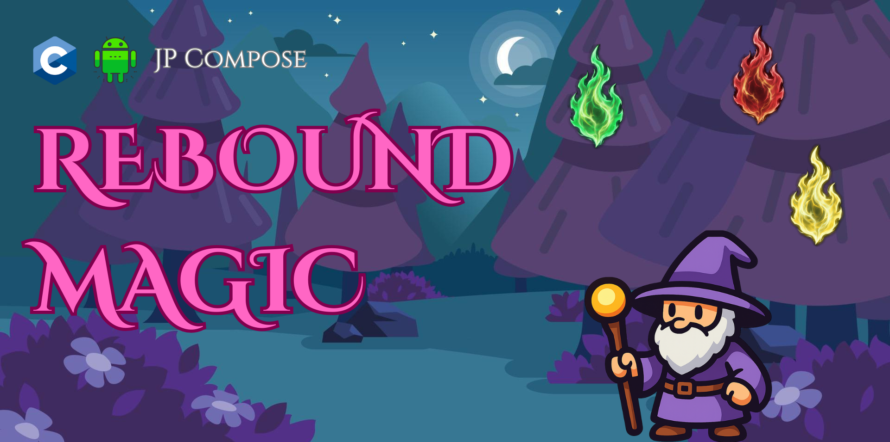

# ✨ Rebound Magic (Remagic)

**Rebound Magic (Remagic)** is an open-source Android game built with **Jetpack Compose**, **JNI**, and the **Firebase C++ SDK** for native integration.

---

## 🎮 Features

* No external graphics libraries
* Device **rotation sensor** control (X axis)
* Game logic in **Kotlin**, UI rendered with **Compose**
* **JNI + C/C++** for native sensor handling
* Integrated **Firebase C++ SDK**
* libCurl C/C++ for **Regolo API** (AI)

---

## 🖼️ Assets




https://github.com/user-attachments/assets/159fe36f-9531-4904-9adb-0b08caad8585

---

## ▶️ How to Play

1. Launch the game on an Android device
2. Rotate the device left or right to move the wizard

---

## 🧪 Native Tests

JNI logic tests are available under `src/androidTest/native/`.
These tests are intended to validate correct sensor handling and native C/C++ calls via JNI, and can be executed directly on an Android device, independently from the game UI and rendering layer.

---

## ⚙️ Gradle Configuration

For correct setup, place your **google-services.json** under `app/` and link your **Firebase C++ SDK** in your `local.properties` (available in the release section):

```
org.gradle.jvmargs=-Xmx2048m -Dfile.encoding=UTF-8
android.useAndroidX=true
kotlin.code.style=official
android.nonTransitiveRClass=true
```
*local.properties :*
```
sdk.dir=C\:\\Users\\...\\AppData\\Local\\Android\\Sdk
arcfour.secret.key= ...
regolo.encrypted.key= ...
firebase_cpp_sdk_dir=C\:\firebase_cpp_sdk
```
