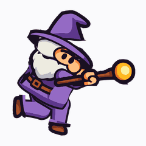

# Sprite di corsa del mago

Ciclo di corsa a 8 frame ricavato da `app/src/main/res/drawable/magician_stand.xml`,
di profilo verso destra (più la variante speculare verso sinistra), coerente con
i `magician_left/right.png` già usati dal gioco.



## Cosa c'è dentro

Gli asset finiti **vivono nell'app**, in `app/src/main/res/drawable-nodpi/`.
Qui resta solo ciò che non si rigenera da sé:

| Percorso | Contenuto |
|---|---|
| `tools/` | la pipeline completa — è la parte che conta |
| `qa/preview_right.gif` | l'animazione, per riguardarla senza rigenerare nulla |
| `qa/parts_check.png` | la prova che la scomposizione è pixel-perfetta |

Tutto il resto (PNG a più dimensioni, sprite sheet, SVG per frame, risorse
Android pronte, le altre immagini di QA) è **output rigenerabile**: lo ricrea la
sequenza in fondo, in circa un minuto, byte-identico. È stato cancellato apposta
per non tenere in repo copie morte di file che sono già dentro l'app.

Il file più prezioso è **`tools/rig.py`**: i poligoni di ritaglio sono coordinate
misurate a mano su questo specifico disegno, ed è il file che è costato più
iterazioni. Da lì si riparte per qualsiasi altra animazione (un salto, un attacco,
un idle che respira) senza rimisurare niente. `tools/grid.py` e
`tools/dump_parts.py` sono gli strumenti di misura: servono solo se l'artwork del
mago cambia e i poligoni vanno rifatti.

> La pipeline dipende da `app/src/main/res/drawable/magician_stand.xml`. Se quel
> file viene spostato o ridisegnato, le regioni in `rig.py` vanno rimisurate.

## Come è stato costruito

Il sorgente è un **auto-trace**: tutto il tratto nero della figura è un unico
sotto-path da 1507 punti che avvolge l'intero personaggio. Non è quindi possibile
separare un arto scegliendo dei path. Il rig quindi:

1. **Ritaglia per regioni.** Ogni parte è definita da un poligono nel viewport
   1024×1024 e ottiene *tutto* l'artwork ritagliato da una `<mask>` SVG: la
   propria regione meno quelle delle parti a priorità più alta. Ogni parte
   istanzia il disegno completo, non un sottoinsieme di path — è ciò che rende il
   riassemblaggio identico all'originale (i path sorgente si sovrappongono: per
   esempio un'ombra della veste è dipinta sopra la barba).
2. **Ricompone in posa.** Ogni parte è piazzata da una matrice affine costruita
   sui giunti misurati sul disegno: testa, cono del cappello, barba, cintura,
   mani, stivali e bastone sono **artwork originale**, spostato e ruotato.
3. **Disegna ciò che non esiste.** Gambe, braccia, veste laterale e **volto** sono
   ridisegnati. Nel sorgente frontale le gambe sono nascoste sotto la veste e il
   petto è interamente coperto dalla barba, quindi non c'era nulla da ritagliare;
   il volto invece è perfettamente simmetrico — due occhi uguali, naso centrale —
   e comunque lo si ruoti continua a guardare in camera invece che nella direzione
   di corsa. È stato quindi ridisegnato di tre quarti: capelli che risalgono dietro
   sotto la tesa, cuneo di pelle sulla metà anteriore, naso che sporge oltre il
   profilo, sopracciglio e occhi stretti puntati in avanti. Tutto con la stessa
   palette, lo stesso spessore di contorno (20u) e la stessa ombreggiatura a due
   toni del sorgente. Cappello, tesa, barba, cintura, mani, stivali e bastone
   restano artwork originale.
4. **Anima con IK sul piede.** Il ciclo non è keyframato per angoli: si definisce
   il percorso del piede e l'altezza del bacino, e la gamba è risolta in cinematica
   inversa. Nei frame di appoggio la caviglia è inchiodata al suolo, per cui il
   piede non slitta e il rimbalzo del corpo nasce dalla geometria.

Frame 0 è il contatto del piede vicino; l'appoggio dura 3 frame per gamba, con 2
frame di volo (f3 e f7).

## Validazione

Due controlli automatici, entrambi da rieseguire dopo qualsiasi modifica al rig:

- **`check_parts.py`** stampa il diff del riassemblaggio contro l'originale
  intatto, che si ri-renderizza da sé per essere sempre allineato all'SVG in uso.
  Esito atteso: **0 px di alpha persa** su 1.048.576 — i tagli non hanno
  introdotto né cuciture né buchi. Restano ~200 px che differiscono leggermente
  di colore, sui bordi antialiasati. Salva anche `qa/parts_check.png`, dove ogni
  parte è isolata e il riquadro DIFF dev'essere nero.
- **`frames.py`** stampa la posizione della suola in appoggio frame per frame.
  Esito atteso: sui 6 frame di contatto resta entro **2 px** (885,6–887,3 su una
  figura alta ~570), cioè lo 0,3% dell'altezza — il piede non slitta.

`export.py` rigenera anche le immagini di ispezione visiva in `qa/`: i frame
affiancati, gli 8 frame sovrapposti in onion-skin (mostra gli archi di movimento:
testa e bastone devono restare compatti, le gambe descrivere un arco pulito) e le
GIF. Servono all'occhio, non danno un verdetto numerico.

## Integrazione nel gioco — già fatta

Lo sprite è **già collegato**. Cosa è cambiato:

- `app/src/main/res/drawable-nodpi/` — 17 PNG nuovi: `magician_run_right_0…7`,
  `magician_run_left_0…7`, `magician_idle`. Sono a 240 px, cioè
  `MAGICIAN_FRAME_SIDE`, quindi la vecchia `.scale(...)` a runtime è sparita.
- `GameConstants.kt` — aggiunta `MAGICIAN_RUN_FRAME_MS = 70L`.
- `GameScreen.kt` — le 3 bitmap statiche sono diventate due liste di frame più
  la posa da fermo; un `LaunchedEffect` fa avanzare l'indice solo mentre
  `moveDirection != STAND` e lo azzera da fermo, così la falcata riparte sempre
  dal frame di contatto.

`R.raw.magician_left/right/stand` non sono più usati da nessuna parte ma li ho
lasciati al loro posto: rimuoverli è una tua scelta. Attenzione che
`@drawable/magician_stand` (il **vettoriale**, non il PNG in `raw/`) serve ancora
allo splash screen in `themes.xml`, quindi quello va tenuto.

Verificato con `./gradlew :app:compileDebugKotlin`: compila, nessun warning nuovo.
La build completa richiede un `google-services.json` che su questa macchina non
c'è; ne ho usato uno fittizio solo per compilare e l'ho poi rimosso.

Il codice, in sostanza:

```kotlin
var runFrame by remember { mutableIntStateOf(0) }
LaunchedEffect(uiState.moveDirection) {
    if (uiState.moveDirection == MoveDirection.STAND) {
        runFrame = 0
        return@LaunchedEffect
    }
    while (true) {
        delay(GameConstants.MAGICIAN_RUN_FRAME_MS)
        runFrame++
    }
}

val magicianBmp = when (uiState.moveDirection) {
    MoveDirection.LEFT  -> magicianRunLeft[runFrame % magicianRunLeft.size]
    MoveDirection.RIGHT -> magicianRunRight[runFrame % magicianRunRight.size]
    MoveDirection.STAND -> magicianIdleBmp
}
```

Gli id delle risorse sono elencati esplicitamente in `MAGICIAN_RUN_RIGHT` /
`MAGICIAN_RUN_LEFT` invece di essere calcolati con l'aritmetica su
`R.drawable.magician_run_right_0 + i`, che non è garantita.

**Sull'allineamento a terra.** I frame di corsa mettono il suolo al 92%
dell'altezza; il vecchio `magician_stand.png` aveva i piedi al 97% e
`magician_left/right.png` al 77%, cioè tre allineamenti già diversi fra loro. Per
non far saltare il mago quando parte e si ferma, `magician_idle.png` è la posa
frontale originale **ri-inquadrata** nella stessa finestra di ritaglio dei frame
di corsa: stessa scala, stessa linea di terra. Il disegno è intatto, cambia solo
l'inquadratura.

Se invece servisse un `ImageView`, `tools/android.py` genera anche
`magician_run_{right,left}.xml`, un `<animation-list>` pronto
(`(drawable as AnimationDrawable).start()`). Il gioco non lo usa perché disegna
su `Canvas`.

## Rigenerare

**Da eseguire dalla root del repo**, non da `sprite/`: gli script hanno i percorsi
scritti come `sprite/...`.

```bash
brew install librsvg                     # fornisce rsvg-convert
python3 -m venv .venv && .venv/bin/pip install pillow numpy

.venv/bin/python sprite/tools/avd2svg.py \
    app/src/main/res/drawable/magician_stand.xml sprite/svg/magician_stand.svg
.venv/bin/python sprite/tools/check_parts.py   # scomposizione + diff col sorgente
.venv/bin/python sprite/tools/frames.py        # ciclo + controllo di appoggio
.venv/bin/python sprite/tools/export.py        # ritaglio comune, PNG, sheet, GIF
.venv/bin/python sprite/tools/android.py       # risorse Android

rm -rf sprite/qa/_raw sprite/qa/_parts_check   # cartelle di lavoro
cp sprite/frames/run_right_240/*.png sprite/frames/run_left_240/*.png \
   sprite/frames/idle_240/magician_idle.png app/src/main/res/drawable-nodpi/
```

Ogni script crea le cartelle che gli servono, quindi la sequenza parte anche da
`sprite/` ridotta a `tools/` — verificato: rigenera i 17 PNG **byte-identici** a
quelli già nell'app.

Per ritoccare l'animazione, tutto sta in `tools/frames.py`: `FOOT_PATH` (percorso
del piede), `HIP_Y` (rimbalzo), e la tabella `CYCLE` per inclinazione, testa,
cappello, braccia e bastone. Le proporzioni del personaggio e la forma della veste
stanno in `tools/pose.py`; i confini dei ritagli in `tools/rig.py`.

## Limiti noti

- **Nessuna linea di velocità.** I `magician_left/right.png` attuali le hanno
  disegnate sopra; qui sono state omesse perché su un ciclo animato il movimento è
  già leggibile e le linee statiche pulsano. Vanno aggiunte come layer separato se
  si vuole restare identici all'asset attuale.
- **Il volto è di tre quarti, non di profilo pieno.** Si vedono entrambi gli occhi,
  come nel `magician_right.png` di riferimento. Un profilo vero richiederebbe di
  eliminare l'occhio lontano e ridisegnare anche la tesa.
- **La barba è rigida** con la testa: non svolazza. Servirebbe staccarla come
  parte a sé.
